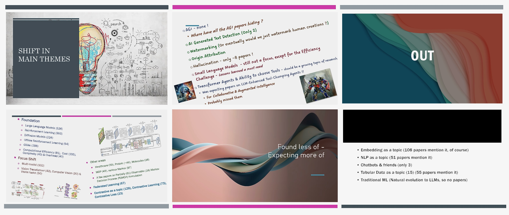
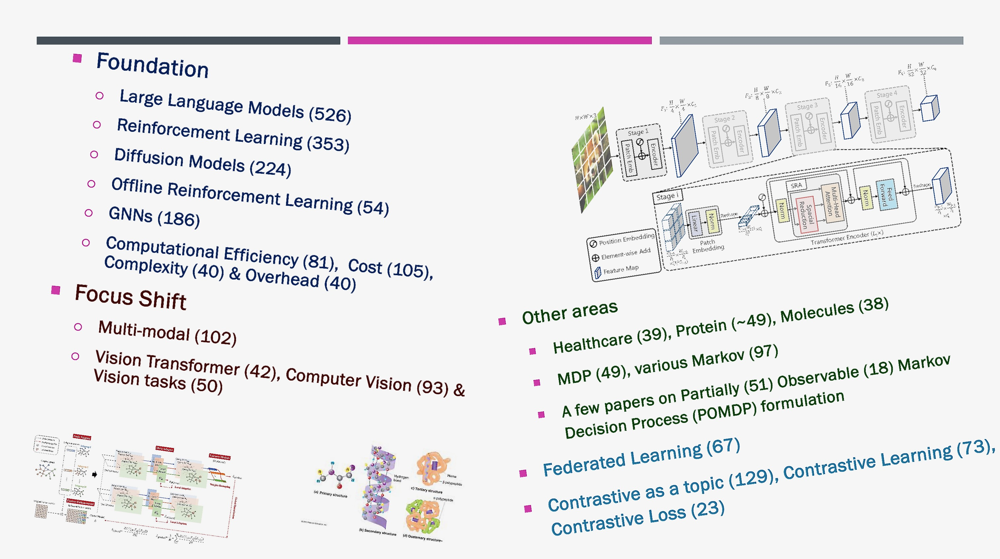
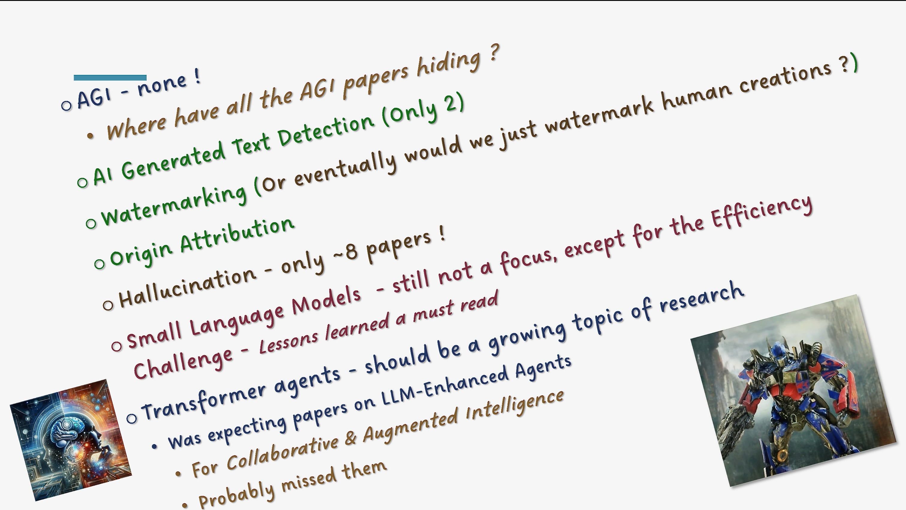
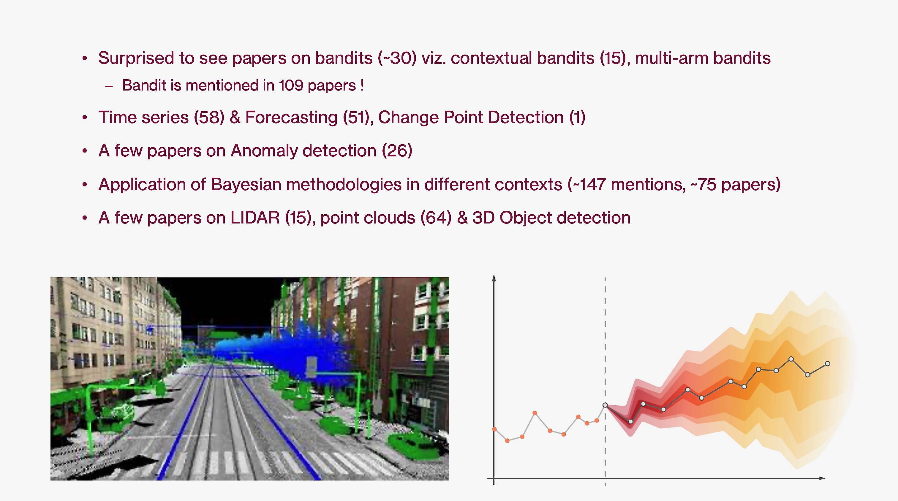
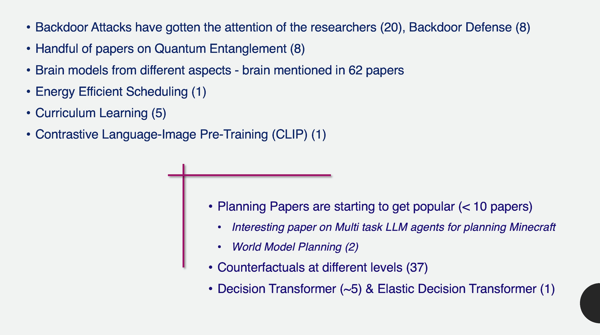
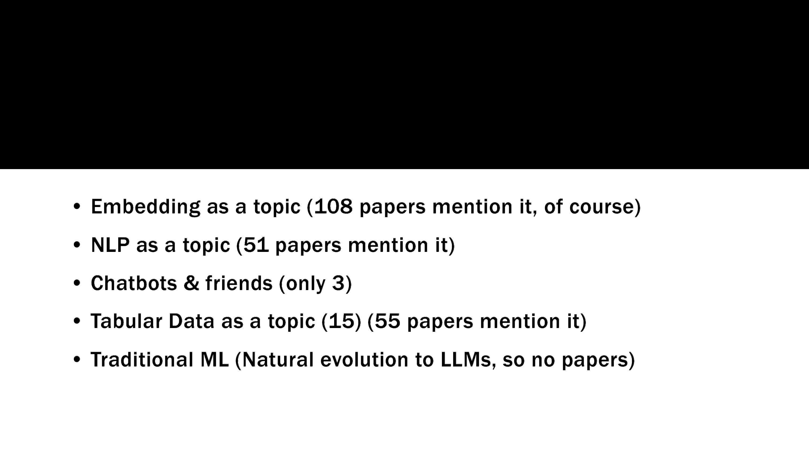

### Awesome-NeurIPS-2023 : Observations & Interesting Papers (selected from 3,584 papers)
#### _[Back to TOC](https://github.com/xsankar/Awesome-Awesome-LLM)_
| [About Me](https://www.linkedin.com/in/ksankar) | [Blog](https://ksankar.medium.com) |
| :- | :- |

---
| [Now](#now) | [Interesting](#interesting) | [Towards AGI](#towards-agi) | [Planning](#planning) | [Reasoning](reasoning) | [Alignment](alignment) | [RL](rl) |
| :- | :- | :- | :- | :- | :- | :- |

[Prompting](#prompting) | [Small Language Models](#slm) | [Training Efficiency](#training-efficiency) | [Fine Tuning/RAG](#fine-tuning-rag) | [Attack Mitigation](#attack-mitigation) | [Datasets](#datasets) | [Benchmarks](#benchmarks) |
| :- | :- | :- | :- | :- | :- | :- |

[Decoding Transformers](#decoding-transformers) | [NN Design & Insights](#nn-design--insights) | [Embedding](#embedding) |  | |  |  |
| :-: | :-: | :-: | :-: | :-: | :-: | :-: |

[AI Generated Text Detection](#ai-generated-text-detection) | [Watermarking](#watermarking) | [Origin Attribution](#origin-attribution) | [Bias/Fairness](#bias-fairness) | [Explainability](#explainability) | [Other](#other) |  |
| :-: | :-: | :-: | :-: | :-: | :-: | :-: |
---
### Observations - [Blog](https://medium.com/@ksankar/neurips-2023-unboxed-whats-in-what-s-out-cutting-edge-generative-ai-research-from-3-784-eec08394eadb)

  
   

***

  
   

***

  
   

***

  
   

***

  
   

***
## Now
[Top](#back-to-toc)
| Year | Title | Notes | 
| -: | :- | :- |
| | Survey Papers | |
***
## Interesting
[Top](#back-to-toc)
| Year | Title | Notes | 
| -: | :- | :- |
| | Survey Papers | |
***
## Datasets
[Top](#back-to-toc)
| Title | Poster | Paper | Github |
| -: | -: | -: | -: |
| Where Did I Come From? Origin Attribution of AI-Generated Images   [NeurIPS link - Short Video & Abstract](https://neurips.cc/virtual/2023/poster/70868)|  | [Paper](https://openreview.net/forum?id=g8bjq0qxOl) | |
| | | |
***
## AI Generated Text Detection
[Top](#back-to-toc)
| Title | Poster | Paper | Github |
| -: | -: | -: | -: |
| RADAR: Robust AI-Text Detection via Adversarial Learning   [NeurIPS link - Short Video & Abstract](https://neurips.cc/virtual/2023/poster/71713)| [Poster](https://neurips.cc/media/PosterPDFs/NeurIPS%202023/71713.png?t=1699290320.7839897) | [Paper](https://openreview.net/forum?id=QGrkbaan79) | |
| Intrinsic Dimension Estimation for Robust Detection of AI-Generated Texts   [NeurIPS link - Short Video & Abstract](https://neurips.cc/virtual/2023/poster/72624)| [Poster](https://neurips.cc/media/PosterPDFs/NeurIPS%202023/72624.png?t=1701451368.9923096) | [Paper](https://openreview.net/forum?id=8uOZ0kNji6) | |
| | | |
***
## Watermarking
[Top](#back-to-toc)
| Title | Poster | Paper | Github |
| -: | -: | -: | -: |
| Tree-Rings Watermarks: Invisible Fingerprints for Diffusion Images   [NeurIPS link - Short Video & Abstract](https://neurips.cc/virtual/2023/poster/71259)| [Poster](https://neurips.cc/media/PosterPDFs/NeurIPS%202023/71259.png?t=1699370145.5634189) | [Paper](https://openreview.net/forum?id=Z57JrmubNl) | [Github](https://github.com/YuxinWenRick/tree-ring-watermark)|
| | | |
***
## Origin Attribution
[Top](#back-to-toc)
| Title | Poster | Paper | Github |
| -: | -: | -: | -: |
| Where Did I Come From? Origin Attribution of AI-Generated Images   [NeurIPS link - Short Video & Abstract](https://neurips.cc/virtual/2023/poster/70868)|  | [Paper](https://openreview.net/forum?id=g8bjq0qxOl) | |
| | | |
***
## Bias/Fairness
[Top](#back-to-toc)
| Title | Poster | Paper | Github |
| -: | -: | -: | -: |
| Where Did I Come From? Origin Attribution of AI-Generated Images   [NeurIPS link - Short Video & Abstract](https://neurips.cc/virtual/2023/poster/70868)|  | [Paper](https://openreview.net/forum?id=g8bjq0qxOl) | |
| | | |
***
## Explainability
[Top](#back-to-toc)
| Title | Poster | Paper | Github |
| -: | -: | -: | -: |
| Where Did I Come From? Origin Attribution of AI-Generated Images   [NeurIPS link - Short Video & Abstract](https://neurips.cc/virtual/2023/poster/70868)|  | [Paper](https://openreview.net/forum?id=g8bjq0qxOl) | |
| | | |
***
## Other
[Top](#back-to-toc)
| Title | Poster | OpenReview | Github |
| -: | -: | -: | -: |
| MEMTO: Memory-guided Transformer for Multivariate Time Series Anomaly Detection   [NeurIPS link - Short Video & Abstract](https://neurips.cc/virtual/2023/poster/71519)| [Poster](https://neurips.cc/media/PosterPDFs/NeurIPS%202023/71519.png?t=1698648523.5159426) | [Paper](https://openreview.net/forum?id=UFW67uduJd) | [Github](https://github.com/gunny97/MEMTO)|
| When Do Neural Nets Outperform Boosted Trees on Tabular Data?   [NeurIPS link - Short Video & Abstract](https://neurips.cc/virtual/2023/poster/73658)| [Poster](https://neurips.cc/media/PosterPDFs/NeurIPS%202023/73658.png?t=1702274686.1162755) | [Paper](https://openreview.net/forum?id=CjVdXey4zT) | |
| Encoding Human Behavior in Information Design through Deep Learning   [NeurIPS link - Short Video & Abstract](https://neurips.cc/virtual/2023/poster/71241)| [Poster](https://neurips.cc/media/PosterPDFs/NeurIPS%202023/71241.png?t=1702235033.2933419) | [Paper](https://openreview.net/forum?id=ZOKhtz2Z9X) | |
| Monte Carlo Tree Search with Boltzmann Exploration   [NeurIPS link - Short Video & Abstract](https://neurips.cc/virtual/2023/poster/71873)   _I have been doing some work in MCTS since the days of AlphaGO. I still have some code and a beautiful go board with exotic stones_| [Poster](https://neurips.cc/media/PosterPDFs/NeurIPS%202023/71873.png?t=1702041264.953116) | [Paper](https://openreview.net/forum?id=NG4DaApavi)   [Slides](https://neurips.cc/media/neurips-2023/Slides/71873.pdf)| |
| | | |
***
***
