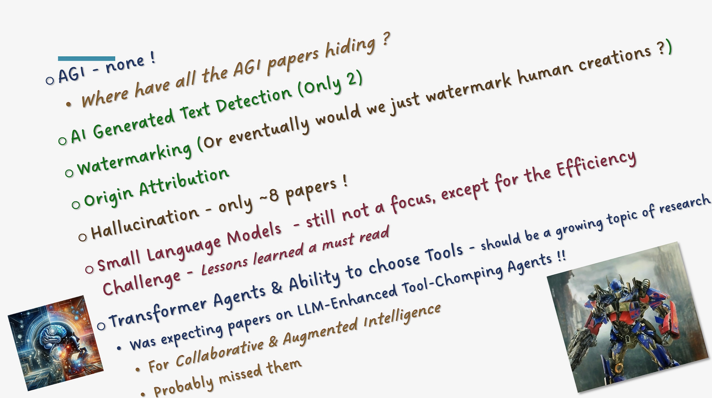

### Awesome-NeurIPS-2023 : Observations & Interesting Papers (selected from 3,584 papers)
#### _[Back to TOC](https://github.com/xsankar/Awesome-Awesome-LLM)_
| [About Me](https://ksankar.medium.com/about-me-the-pitter-patter-of-small-feats-de22f4c36ea6) | [Blog](https://ksankar.medium.com) |
| :- | :- |

---
| [Now](#now) | [Interesting](#interesting) | [Towards AGI](#towards-agi) | [Planning](#planning) | [Reasoning](#reasoning) | [Alignment](#alignment) | [RL](#rl) |
| :- | :- | :- | :- | :- | :- | :- |

[Prompting](#prompting) | [Small Language Models](#slm) | [Attack Mitigation](#attack-mitigation) | [Datasets](#datasets) | [Benchmarks](#benchmarks) |
| :- | :- | :- | :- | :- |

[Decoding Transformers](#decoding-transformers) | [NN Design & Insights](#nn-design--insights) | [Embedding](#embedding) |  | |  |  |
| :-: | :-: | :-: | :-: | :-: | :-: | :-: |

[AI Generated Text Detection](#ai-generated-text-detection) | [Watermarking](#watermarking) | [Origin Attribution](#origin-attribution) | [Bias/Fairness](#biasfairness) | [Explainability](#explainability) | [Other](#other) |  |
| :-: | :-: | :-: | :-: | :-: | :-: | :-: |
---
### Observations - [Blog](https://medium.com/@ksankar/neurips-2023-unboxed-whats-in-what-s-out-cutting-edge-generative-ai-research-from-3-784-eec08394eadb)

  
   

***

  
   

***

  
   

***

  
   

***

  
   

***
## Now
[Top](#back-to-toc)
> Papers I want to read and understand now. Also have tagged interesting papers from other sections in **bold**
> 
| Title | Poster | OpenReview | GitHub |
| -: | -: | :-: | -: |
|    [NeurIPS link - Short Video & Abstract]()| [Poster]() | [Paper]() | [GitHub]() |
| | | | |
***
## Interesting
[Top](#back-to-toc)
> Papers one should think about. New Computing Paradigms, a new object detection variation (Gold-YOLO), couple of papers on Nash, ChessGPT (_one of my long term interests to see if GPT can play like Tal, Paul Keras, Paul Morphy, Capablanca, Botvinnik and of course Fisher!_),…
> >
| Title | Poster | OpenReview | GitHub |
| -: | -: | :-: | -: |
| Machine Learning with New Compute Paradigms   [NeurIPS link - Workshop Video & Abstract](https://neurips.cc/virtual/2023/workshop/66533)| | | [Workshop](https://www.mlwithnewcompute.com/) |
| Workshop : Information-Theoretic Principles in Cognitive Systems (InfoCog)   [NeurIPS link - Workshop Video & Abstract](https://neurips.cc/virtual/2023/workshop/66535)| | | [Workshop](https://sites.google.com/view/infocog-neurips-2023) |
| MATH-AI: The 3rd Workshop on Mathematical Reasoning and AI   [NeurIPS link - Workshop Video & Abstract](https://neurips.cc/virtual/2023/workshop/66522)| | | [Workshop](https://mathai2023.github.io/) |
| Segment Everything Everywhere All at Once   [NeurIPS link - Short Video & Abstract](https://neurips.cc/virtual/2023/poster/71518)   _Notes:The best named paper award!!_| [Slides](https://neurips.cc/media/neurips-2023/Slides/71518_SMIwV0i.pdf) | [Paper](https://openreview.net/forum?id=UHBrWeFWlL) | [GitHub](https://github.com/UX-Decoder/Segment-Everything-Everywhere-All-At-Once) |
| On the Need for a Language Describing Distribution Shifts: Illustrations on Tabular Datasets   [NeurIPS link - Short Video & Abstract](https://neurips.cc/virtual/2023/poster/73603)   _Notes:At last, there is still interest in tabular data !!! ! _| [Poster](https://neurips.cc/media/PosterPDFs/NeurIPS%202023/73603.png?t=1701636498.9203691) | [Paper](https://openreview.net/forum?id=PF0lxayYST) | [GitHub](https://github.com/namkoong-lab/whyshift) |
| Auditing for Human Expertise    [NeurIPS link - Short Video & Abstract](https://neurips.cc/virtual/2023/poster/71468)   _Notes:The fact that such a paper exist itself is interesting_| [Poster](https://neurips.cc/media/PosterPDFs/NeurIPS%202023/71468.png?t=1702254247.2812443) | [Paper](https://openreview.net/forum?id=VEpU9rFaQr) | |
| Gold-YOLO: Efficient Object Detector via Gather-and-Distribute Mechanism   [NeurIPS link - Short Video & Abstract](https://neurips.cc/virtual/2023/poster/70602)   _Notes: Out of interest from my past work - Object Detection for autonomous driving. YOLO, at that time was V3 and pretty effective_| [Poster](https://neurips.cc/media/PosterPDFs/NeurIPS%202023/70602.png?t=1698075176.0605502) | [Paper](https://openreview.net/forum?id=lJDoPAjkCV) | |
| Scaling laws for language encoding models in fMRI   [NeurIPS link - Short Video & Abstract](https://neurips.cc/virtual/2023/poster/72951)   _Notes:We found that brain prediction performance scales logarithmically with model size from 125M to 30B parameter models, with ~15% increased encoding performance_| [Poster](https://neurips.cc/media/PosterPDFs/NeurIPS%202023/72951.png?t=1702109230.768798) | [Paper](https://openreview.net/forum?id=2W4LxJbgec) | |
| A Path to Simpler Models Starts With Noise   [NeurIPS link - Short Video & Abstract](https://neurips.cc/virtual/2023/poster/71482)   The Rashomon set is the set of models that perform approximately equally well on a given dataset, and the Rashomon ratio is the fraction of all models in a given hypothesis space that are in the Rashomon set. Rashomon ratios are often large for tabular datasets in criminal justice, healthcare, lending, education, and in other areas, which has practical implications about whether simpler models can attain the same level of accuracy as more complex models. An open question is why Rashomon ratios often tend to be large_ | [Poster](https://neurips.cc/media/PosterPDFs/NeurIPS%202023/71482.png?t=1701869009.040679)   [Slides](https://neurips.cc/media/neurips-2023/Slides/71482.pdf) | [Paper](https://openreview.net/forum?id=Uzi22WryyX) | |
| ChessGPT: Bridging Policy Learning and Language Modeling   [NeurIPS link - Short Video & Abstract](https://neurips.cc/virtual/2023/poster/73461)   Notes:This I need to try. Can it play like the grandmasters of yesteryears ?_| | [Paper](https://openreview.net/forum?id=pvdm4B6JMK) | |
| Nash Regret Guarantees for Linear Bandits   [NeurIPS link - Short Video & Abstract](https://neurips.cc/virtual/2023/poster/71921)| [Poster](https://neurips.cc/media/PosterPDFs/NeurIPS%202023/71921.png?t=1701971731.8136826) | [Paper](https://openreview.net/forum?id=MCkUS1P3Sh) | |
| Computing Optimal Nash Equilibria in Multiplayer Games   [NeurIPS link - Short Video & Abstract](https://neurips.cc/virtual/2023/poster/70624)| [Poster](https://neurips.cc/media/PosterPDFs/NeurIPS%202023/70624.png?t=1698634430.1629207) | [Paper](https://openreview.net/forum?id=kupNhxLc6k) | |
| Strategyproof Voting under Correlated Beliefs   [NeurIPS link - Short Video & Abstract](https://neurips.cc/virtual/2023/poster/70962)   _Notes:Think we would have this in all our voting machines in time for the 2024 eections ?_| [Poster](https://neurips.cc/media/PosterPDFs/NeurIPS%202023/70962.png?t=1701313446.1340103) | [Paper](https://openreview.net/forum?id=eT1QOsssRB) | |
| | | | |
***
## Towards AGI
[Top](#back-to-toc)
> _**General AGI related papers. I have broken out other AGI relevant sections by themselves below - Planning, Reasoning, Alignment & RL**_
> _**IMHO there is no real AGI paper yet**_
> 
| Title | Poster | OpenReview | GitHub |
| -: | -: | :-: | -: |
| **AI meets Moral Philosophy and Moral Psychology: An Interdisciplinary Dialogue about Computational Ethics**    [NeurIPS link - Workshop Videos & Abstract](https://neurips.cc/virtual/2023/workshop/66528)   _**Notes:a series of in-person invited talks from leading scholars working at the intersection of AI, psychology, and philosophy on issues related to morality**_| | | [GitHub](https://aipsychphil.github.io/) |
| **Language Models Meet World Models**   [NeurIPS link - Tutorial Video & Abstract](https://neurips.cc/virtual/2023/tutorial/73952)| | [Paper](https://arxiv.org/abs/2312.05230)   [Slides](https://sites.google.com/view/neurips2023law) | [GitHub]() |
| **Are Emergent Abilities of Large Language Models a Mirage?**   [NeurIPS link - Short Video & Abstract](https://neurips.cc/virtual/2023/oral/73863)| [Poster](https://neurips.cc/virtual/2023/poster/72117) | [Paper](https://openreview.net/forum?id=ITw9edRDlD) | |
| Competition : MyoChallenge 2023: Towards Human-Level Dexterity and Agility   [NeurIPS link - Short Video & Abstract](https://neurips.cc/virtual/2023/competition/66584)| | | [GitHub](https://sites.google.com/view/myosuite/myosymposium/neurips23) |
| OpenAGI: When LLM Meets Domain Experts   [NeurIPS link - Short Video & Abstract](https://neurips.cc/virtual/2023/poster/73509)| [Poster](https://neurips.cc/media/PosterPDFs/NeurIPS%202023/73509.png?t=1701378318.151941) | [Paper](https://openreview.net/forum?id=gFf0a0ZxJM) | [GitHub](https://github.com/agiresearch/OpenAGI) |
| Self-Predictive Universal AI   [NeurIPS link - Short Video & Abstract](https://neurips.cc/virtual/2023/poster/70391)| | [Paper](https://openreview.net/forum?id=psXVkKO9No) | |
| Parsel: Algorithmic Reasoning with Language Models by Composing Decompositions   [NeurIPS link - Short Video & Abstract](https://neurips.cc/virtual/2023/poster/70349)| [Poster](https://neurips.cc/media/PosterPDFs/NeurIPS%202023/70349.png?t=1701393593.731503) | [Paper](https://openreview.net/forum?id=qd9qcbVAwQ) | |
| | | | |
***
## Planning
[Top](#back-to-toc)
| Title | Poster | OpenReview | GitHub |
| -: | -: | :-: | -: |
| On the Planning Abilities of Large Language Models - A Critical Investigation   [NeurIPS link - Short Video & Abstract](https://neurips.cc/virtual/2023/poster/71377)| | [Paper](https://openreview.net/forum?id=X6dEqXIsEW) | [GitHub](https://github.com/karthikv792/LLMs-Planning) |
| Evaluating Cognitive Maps and Planning in Large Language Models with CogEval   [NeurIPS link - Short Video & Abstract](https://neurips.cc/virtual/2023/poster/71431)   _Notes:CogEval, a cognitive science-inspired protocol for the systematic evaluation of cognitive capacities in LLMs. The CogEval protocol can be followed for the evaluation of various abilities_| | [Paper](https://openreview.net/forum?id=VtkGvGcGe3) | [GitHub](https://github.com/cogeval/cogmaps) |
| Thinker: Learning to Plan and Act   [NeurIPS link - Short Video & Abstract](https://neurips.cc/virtual/2023/poster/70532)| [Poster](https://neurips.cc/media/PosterPDFs/NeurIPS%202023/70532.png?t=1699536681.112018) | [Paper](https://openreview.net/forum?id=mumEBl0arj) | |
| Compositional Foundation Models for Hierarchical Planning   [NeurIPS link - Short Video & Abstract](https://neurips.cc/virtual/2023/poster/70994)   _Notes:To make effective decisions in novel environments with long-horizon goals, it is crucial to engage in hierarchical reasoning across spatial and temporal scales. This entails planning abstract subgoal sequences, visually reasoning about the underlying plans, and executing actions in accordance with the devised plan through visual-motor control_| [Poster](https://neurips.cc/media/PosterPDFs/NeurIPS%202023/70994.png?t=1702492409.9302647) | [Paper](https://openreview.net/forum?id=dyXNh5HLq3) | [GitHub](https://hierarchical-planning-foundation-model.github.io/) |
| Large Language Models as Commonsense Knowledge for Large-Scale Task Planning   [NeurIPS link - Short Video & Abstract](https://neurips.cc/virtual/2023/poster/71394)| [Poster](https://neurips.cc/media/PosterPDFs/NeurIPS%202023/71394.png?t=1701672829.859892)    [Slides](https://neurips.cc/media/neurips-2023/Slides/71394_OsJi6qT.pdf)| [Paper](https://openreview.net/forum?id=Wjp1AYB8lH) | [GitHub](https://llm-mcts.github.io/) |
| | | | |
***
## Reasoning
[Top](#back-to-toc)
| Title | Poster | Paper | GitHub |
| -: | -: | :-: | -: |
| Why think step by step? Reasoning emerges from the locality of experience   [NeurIPS link - Short Video & Abstract](https://neurips.cc/virtual/2023/poster/70306)| | [Paper](https://openreview.net/forum?id=rcXXNFVlEn) | [GitHub](https://github.com/benpry/why-think-step-by-step) |
| Self-Evaluation Guided Beam Search for Reasoning   [NeurIPS link - Short Video & Abstract](https://neurips.cc/virtual/2023/poster/72456)   [Slides](https://neurips.cc/media/neurips-2023/Slides/72456.pdf)| [Poster](https://neurips.cc/media/PosterPDFs/NeurIPS%202023/72456.png?t=1701664029.2364998) | [Paper](https://openreview.net/forum?id=Bw82hwg5Q3) | [GitHub](https://guideddecoding.github.io/) |
| Deductive Verification of Chain-of-Thought Reasoning   [NeurIPS link - Short Video & Abstract](https://neurips.cc/virtual/2023/poster/72140)| [Poster](https://neurips.cc/media/PosterPDFs/NeurIPS%202023/72140.png?t=1701834534.4943933) | [Paper](https://openreview.net/forum?id=I5rsM4CY2z) | |
| Training Chain-of-Thought via Latent-Variable Inference   [NeurIPS link - Short Video & Abstract](https://neurips.cc/virtual/2023/poster/71210)| | [Paper](https://openreview.net/forum?id=a147pIS2Co) | |
| Testing the General Deductive Reasoning Capacity of Large Language Models Using OOD Examples   [NeurIPS link - Short Video & Abstract](https://neurips.cc/virtual/2023/poster/71923)| [Poster](https://neurips.cc/media/PosterPDFs/NeurIPS%202023/71923.png?t=1702192637.0153663) | [Paper](https://openreview.net/forum?id=MCVfX7HgPO) | [GitHub](https://github.com/asaparov/prontoqa) |
| **RealTime QA: What's the Answer Right Now?**   [NeurIPS link - Short Video & Abstract](https://neurips.cc/virtual/2023/poster/73639)| | [Paper](https://openreview.net/forum?id=HfKOIPCvsv) | [GitHub](https://realtimeqa.github.io/) |
| **What’s Left? Concept Grounding with Logic-Enhanced Foundation Models**   [NeurIPS link - Short Video & Abstract](https://neurips.cc/virtual/2023/poster/70248)| [Poster](https://neurips.cc/media/PosterPDFs/NeurIPS%202023/70248.png?t=1701415590.6883197) | [Paper](https://openreview.net/forum?id=sq4o3tjWaj) | [GitHub](https://web.stanford.edu/~joycj/projects/left_neurips_2023) |
| | | | |
***
## Alignment
[Top](#back-to-toc)
| Title | Poster | OpenReview | GitHub |
| -: | -: | :-: | -: |
| Moral Responsibility for AI Systems   [NeurIPS link - Short Video & Abstract](https://neurips.cc/virtual/2023/poster/70687)   _Note:This paper presents a formal definition of Moral Responsibility within the framework of causal models_| | [Paper](https://openreview.net/forum?id=jYIknUIgkd) | |
| Aligning Language Models with Human Preferences via a Bayesian Approach   [NeurIPS link - Short Video & Abstract](https://neurips.cc/virtual/2023/poster/72170)| | [Paper](https://openreview.net/forum?id=HGFcM3UU50) | |
| | | | |
***
## RL
[Top](#back-to-toc)
| Title | Poster | OpenReview | GitHub |
| -: | -: | :-: | -: |
| **Would I have gotten that reward? Long-term credit assignment by counterfactual contribution analysis**   [NeurIPS link - Short Video & Abstract](https://neurips.cc/virtual/2023/poster/69923)| [Poster](https://neurips.cc/media/PosterPDFs/NeurIPS%202023/69923.png?t=1702056992.4346392) | [Paper](https://openreview.net/forum?id=yvqqkOn9Pi) | |
| CQM: Curriculum Reinforcement Learning with a Quantized World Model   [NeurIPS link - Short Video & Abstract](https://neurips.cc/virtual/2023/poster/70196)| [Poster](https://neurips.cc/media/PosterPDFs/NeurIPS%202023/70196.png?t=1701681411.8492868) | [Paper](https://openreview.net/forum?id=tcotyjon2a) |  |
| Off-Policy Evaluation for Human Feedback   [NeurIPS link - Short Video & Abstract](https://neurips.cc/virtual/2023/poster/72371)| | [Paper](https://openreview.net/forum?id=DOdaV0Hqdy) | |
| RLHF   _Notes:RLHF - optimizing against a reward model can improve on reward while degrading performance in other areas, a phenomenon known as reward hacking, alignment tax, or language drift_ | | |
| Fine-Grained Human Feedback Gives Better Rewards for Language Model Training   [NeurIPS link - Short Video & Abstract](https://neurips.cc/virtual/2023/poster/72428)| | [Paper](https://openreview.net/forum?id=CSbGXyCswu) | [GitHub](https://finegrainedrlhf.github.io/) |
| Is RLHF More Difficult than Standard RL? A Theoretical Perspective   [NeurIPS link - Short Video & Abstract](https://neurips.cc/virtual/2023/poster/70238)| | [Paper](https://openreview.net/forum?id=sxZLrBqg50) | |
| | | | |
***
## Prompting
[Top](#back-to-toc)
> Prompting definitely is a section by itself
> 
| Title | Poster | OpenReview | GitHub |
| -: | -: | :-: | -: |
| **Language Models Don't Always Say What They Think: Unfaithful Explanations in Chain-of-Thought Prompting**   [NeurIPS link - Short Video & Abstract](https://neurips.cc/virtual/2023/poster/71118)| [Poster](https://neurips.cc/media/PosterPDFs/NeurIPS%202023/71118.png?t=1702407730.4543743) | [Paper](https://openreview.net/forum?id=bzs4uPLXvi) | |
| **Towards Revealing the Mystery behind Chain of Thought: A Theoretical Perspective**   [NeurIPS link - Short Video & Abstract](https://neurips.cc/virtual/2023/oral/73822)| [Oral](https://neurips.cc/media/PosterPDFs/NeurIPS%202023/70369.png?t=1701768154.957121)    [Poster](https://neurips.cc/virtual/2023/poster/70369)| [Paper](https://openreview.net/forum?id=qHrADgAdYu) | [GitHub]() |
| **Dissecting Chain-of-Thought: Compositionality through In-Context Filtering and Learning**   [NeurIPS link - Short Video & Abstract](https://neurips.cc/virtual/2023/poster/70021)| [Poster]() | [Paper](https://openreview.net/forum?id=xEhKwsqxMa) | |
| **Tree of Thoughts: Deliberate Problem Solving with Large Language Models**   [NeurIPS link - Short Video & Abstract](https://neurips.cc/virtual/2023/poster/72797)| [Oral](https://neurips.cc/virtual/2023/oral/73874) | [Paper](https://openreview.net/forum?id=5Xc1ecxO1h) | |
| Fairness-guided Few-shot Prompting for Large Language Models   [NeurIPS link - Short Video & Abstract](https://neurips.cc/virtual/2023/poster/72392)| [Poster]() | [Paper]() | [GitHub]() |
|    [NeurIPS link - Short Video & Abstract]()| [Poster](https://neurips.cc/media/PosterPDFs/NeurIPS%202023/72392.png?t=1697424443.4240098) | [Paper](https://openreview.net/forum?id=D8oHQ2qSTj) | |
| InfoPrompt: Information-Theoretic Soft Prompt Tuning for Natural Language Understanding   [NeurIPS link - Short Video & Abstract](https://neurips.cc/virtual/2023/poster/70551)| [Poster](https://neurips.cc/media/PosterPDFs/NeurIPS%202023/70551.png?t=1702272675.6431801) | [Paper](https://openreview.net/forum?id=mSNfjOcDUv) | |
| | | | |
***
## SLM
[Top](#back-to-toc)
> Small Language Models - not getting enough attendtion!
> 
| Title | Poster | OpenReview | GitHub |
| -: | -: | :-: | :-: |
| NeurIPS Large Language Model Efficiency Challenge: 1 LLM + 1GPU + 1Day   [NeurIPS link - 3hr Video & Abstract](https://neurips.cc/virtual/2023/competition/66594)   _Notes:Listen to winning team’s strategies. Lots of good invited speakers_| | | [Project Page](https://llm-efficiency-challenge.github.io/) |
| Knowledge-Augmented Reasoning Distillation for Small Language Models in Knowledge-Intensive Tasks   [NeurIPS link - Short Video & Abstract](https://neurips.cc/virtual/2023/poster/70015)| [Poster](https://neurips.cc/media/PosterPDFs/NeurIPS%202023/70015.png?t=1702002600.6314964) | [Paper](https://openreview.net/forum?id=xJLEQQrFia) | |
| | | | |
***
## Attack mitigation
[Top](#back-to-toc)
| Title | Poster | OpenReview | GitHub |
| -: | -: | :-: | -: |
| Red Teaming| | | |
| Red Teaming Deep Neural Networks with Feature Synthesis Tools   [NeurIPS link - Short Video & Abstract](https://neurips.cc/virtual/2023/poster/71808)| [Poster](https://neurips.cc/media/PosterPDFs/NeurIPS%202023/71808.png?t=1701884325.7544134) | [Paper](https://openreview.net/forum?id=Od6CHhPM7I) | [GitHub](https://benchmarking-interpretability.csail.mit.edu/) |
| PII Leakage | | |
| ProPILE: Probing Privacy Leakage in Large Language Models   [NeurIPS link - Short Video & Abstract](https://neurips.cc/virtual/2023/poster/71697)| [Poster](https://neurips.cc/media/PosterPDFs/NeurIPS%202023/71697.png?t=1701754095.4490647) | [Paper](https://openreview.net/forum?id=QkLpGxUboF) | [GitHub](https://staging.parameterlab.de/research/propile) |
| Backdoors | | | |
| Backdoors in Deep Learning: The Good, the Bad, and the Ugly   [NeurIPS link - Workshop Video & Abstract](https://neurips.cc/virtual/2023/workshop/66550)| | | [Workshop](https://neurips2023-bugs.github.io/) |
| Setting the Trap: Capturing and Defeating Backdoors in Pretrained Language Models through Honeypots   [NeurIPS link - Short Video & Abstract](https://neurips.cc/virtual/2023/poster/72945)| [ | [Paper](https://openreview.net/forum?id=2cYxNWNzk3) | |
| Neural Polarizer: A Lightweight and Effective Backdoor Defense via Purifying Poisoned Features   [NeurIPS link - Short Video & Abstract](https://neurips.cc/virtual/2023/poster/71467)| [Poster](https://neurips.cc/media/PosterPDFs/NeurIPS%202023/71467.png?t=1701428519.8006961) | [Paper](https://openreview.net/forum?id=VFhN15Vlkj) | |
| A Unified Detection Framework for Inference-Stage Backdoor Defenses   [NeurIPS link - Short Video & Abstract](https://neurips.cc/virtual/2023/poster/72827)| [Poster](https://neurips.cc/media/PosterPDFs/NeurIPS%202023/72827.png?t=1701873334.846031) | [Paper](https://openreview.net/forum?id=4zWEyYGGfI) | |
| Trojan | | | |
| **TrojLLM: A Black-box Trojan Prompt Attack on Large Language Models**   [NeurIPS link - Short Video & Abstract](https://neurips.cc/virtual/2023/poster/71224)| [Poster](https://neurips.cc/media/PosterPDFs/NeurIPS%202023/71224.png?t=1697497280.3117414) | [Paper](https://openreview.net/forum?id=ZejTutd7VY) | [GitHub](https://github.com/UCF-ML-Research/TrojLLM) |
| **TDC 2023 (LLM Edition): The Trojan Detection Challenge**   [NeurIPS link - Short Video & Abstract](https://neurips.cc/virtual/2023/competition/66583)|  |  | [Workshop](https://trojandetection.ai/workshop) |
| Jailbreaking | | | |
| **Jailbroken: How Does LLM Safety Training Fail?**   [NeurIPS link - Short Video & Abstract](https://neurips.cc/virtual/2023/oral/73831)| [Poster](https://neurips.cc/virtual/2023/poster/70702) | [Paper](https://openreview.net/forum?id=jA235JGM09) | |
| Adversarial Robustness | | | |
| Are aligned neural networks adversarially aligned?   [NeurIPS link - Short Video & Abstract](https://neurips.cc/virtual/2023/poster/71817)| | [Paper](https://openreview.net/forum?id=OQQoD8Vc3B) | |
| Improving Adversarial Robustness via Information Bottleneck Distillation   [NeurIPS link - Short Video & Abstract](https://neurips.cc/virtual/2023/poster/70122)| [Poster](https://neurips.cc/media/PosterPDFs/NeurIPS%202023/70122.png?t=1702035880.2177527) | [Paper](https://openreview.net/forum?id=v5Aaxk4sSy) | [GitHub](https://github.com/SkyKuang/IBD) |
| Revisiting Adversarial Training for ImageNet: Architectures, Training and Generalization across Threat Models    [NeurIPS link - Short Video & Abstract](https://neurips.cc/virtual/2023/poster/71757)| [Slides](https://neurips.cc/media/neurips-2023/Slides/71757.pdf) | [Paper](https://openreview.net/forum?id=Pbpk9jUzAi) | [GitHub](https://github.com/nmndeep/revisiting-at) |
| BERT Lost Patience Won't Be Robust to Adversarial Slowdown   [NeurIPS link - Short Video & Abstract](https://neurips.cc/virtual/2023/poster/71547)| [Poster](https://neurips.cc/media/PosterPDFs/NeurIPS%202023/71547.png?t=1700167301.5787725)   [SLides](https://neurips.cc/media/neurips-2023/Slides/71547.pdf)| [Paper](https://openreview.net/forum?id=TcG8jhOPdv) | [GitHub](https://github.com/ztcoalson/WAFFLE) |
| Others | | | |
| **On the Exploitability of Instruction Tuning**   [NeurIPS link - Short Video & Abstract](https://neurips.cc/virtual/2023/poster/72871)| [Poster](https://neurips.cc/media/PosterPDFs/NeurIPS%202023/72871.png?t=1701306042.5043871) | [Paper](https://openreview.net/forum?id=4AQ4Fnemox) | |
| **ParaFuzz: An Interpretability-Driven Technique for Detecting Poisoned Samples in NLP**   [NeurIPS link - Short Video & Abstract](https://neurips.cc/virtual/2023/poster/72384)   _**Notes:Look at datasets and tests**_| [Poster](https://neurips.cc/media/PosterPDFs/NeurIPS%202023/72384.png?t=1701551619.9559908)   [Slides](https://neurips.cc/media/neurips-2023/Slides/72384.pdf)| [Paper](https://openreview.net/forum?id=DD0QJvPbTD) | |
| | | | |
***
## Datasets
[Top](#back-to-toc)
> _**Datasets curation is an under appreciated and thankless work - extremely essential. So kudos to the authors of these papers. We all should contribute to dataset curation …**_
> 
| Title | Poster | OpenReview | GitHub |
| -: | -: | :-: | -: |
| Data Portraits: Recording Foundation Model Training Data   [NeurIPS link - Short Video & Abstract](https://neurips.cc/virtual/2023/poster/73544)| [Poster](https://neurips.cc/media/PosterPDFs/NeurIPS%202023/73544.png?t=1702056632.9252276) | [Paper](https://openreview.net/forum?id=ZrNRBmOzwE) | |
| Ethical Considerations for Responsible Data Curation   [NeurIPS link - Short Video & Abstract](https://neurips.cc/virtual/2023/poster/73597)| [Poster](https://neurips.cc/media/PosterPDFs/NeurIPS%202023/73597.png?t=1701503946.5888417)   [Slides](https://neurips.cc/media/neurips-2023/Slides/73597_9XJ24O7.pdf) | [Paper](https://openreview.net/forum?id=Qf8uzIT1OK) | [GitHub](https://sonyresearch.github.io/responsible_data_curation/) |
| Synthetic Data Generation with Generative AI   [NeurIPS link - Short Video & Abstract](https://neurips.cc/virtual/2023/workshop/66540)| |  | [GitHub](https://www.syntheticdata4ml.vanderschaar-lab.com/) |
| REASONER: An Explainable Recommendation Dataset with Comprehensive Labeling Ground Truths   [NeurIPS link - Short Video & Abstract](https://neurips.cc/virtual/2023/poster/73475)   _**Notes:Explainable recommendation has attracted much attention from the industry and academic communities. It has shown great potential to improve the recommendation persuasiveness, informativeness and user satisfaction**_| [Poster](https://neurips.cc/media/PosterPDFs/NeurIPS%202023/73475.png?t=1701608717.1668952) | [Paper](https://openreview.net/forum?id=n4OwK8cpx2) | [GitHub](https://reasoner2023.github.io/) |
| Learning to Taste: A Multimodal Wine Dataset   [NeurIPS link - Short Video & Abstract](https://neurips.cc/virtual/2023/poster/73572)| [Poster](https://neurips.cc/media/PosterPDFs/NeurIPS%202023/73572.png?t=1699487351.6972504) | [Paper](https://openreview.net/forum?id=VeJgZYhT7H) | [GitHub](https://thoranna.github.io/learning_to_taste/) |
| ChimpACT: A Longitudinal Dataset for Understanding Chimpanzee Behaviors   [NeurIPS link - Short Video & Abstract](https://neurips.cc/virtual/2023/poster/73707)   _**Notes:ChimpACT, a comprehensive dataset for quantifying the longitudinal behavior and social relations of chimpanzees within a social group. Spanning from 2015 to 2018, ChimpACT features videos of a group of over 20 chimpanzees residing at the Leipzig Zoo, Germany. 163 videos with a cumulative 160,500 frames, each richly annotated with detection, identification, pose estimation, and fine-grained spatiotemporal behavior labels.**_| [Poster](https://neurips.cc/media/PosterPDFs/NeurIPS%202023/73707.png?t=1698476277.215272)   [Slides](https://neurips.cc/media/neurips-2023/Slides/73707.pdf) | [Paper](https://openreview.net/forum?id=393EoKpJN3) | [GitHub](https://shirleymaxx.github.io/ChimpACT/) |
| SoundCam: A Dataset for Finding Humans Using Room Acoustics   [NeurIPS link - Short Video & Abstract](https://neurips.cc/virtual/2023/poster/73471)| | [Paper](https://openreview.net/forum?id=oQSfcVTNr1) | [GitHub](https://masonlwang.com/soundcam/) |
| The Harvard USPTO Patent Dataset: A Large-Scale, Well-Structured, and Multi-Purpose Corpus of Patent Application   [NeurIPS link - Short Video & Abstract](https://neurips.cc/virtual/2023/poster/73442)| | [Paper](https://openreview.net/forum?id=tk27oD2cBw) | [GitHub](https://patentdataset.org/) |
| WCLD: Curated Large Dataset of Criminal Cases from Wisconsin Circuit Courts   [NeurIPS link - Short Video & Abstract](https://neurips.cc/virtual/2023/poster/73700)| [Poster](https://neurips.cc/media/PosterPDFs/NeurIPS%202023/73700.png?t=1699628306.1286807) | [Paper](https://openreview.net/forum?id=4kV7qDi0EB) | [GitHub](http://clezdata.github.io/wcld/) |
| What Can We Learn from Unlearnable Datasets?   [NeurIPS link - Short Video & Abstract](https://neurips.cc/virtual/2023/poster/69956)| [Poster](https://neurips.cc/media/PosterPDFs/NeurIPS%202023/69956.png?t=1701374991.9315956) | [Paper](https://openreview.net/forum?id=yGs9vTRjaE) | [GitHub](https://github.com/psandovalsegura/learn-from-unlearnable) |
| The RefinedWeb Dataset for Falcon LLM: Outperforming Curated Corpora with Web Data Only   [NeurIPS link - Short Video & Abstract](https://neurips.cc/virtual/2023/poster/73487)   _**Notes:Very Interesting. They get good perforrmance just with web data**_ | | [Paper](https://openreview.net/forum?id=kM5eGcdCzq) | |
| Amazon-M2: A Multilingual Multi-locale Shopping Session Dataset for Recommendation and Text Generation   [NeurIPS link - Short Video & Abstract](https://neurips.cc/virtual/2023/poster/73435)| [Poster](https://neurips.cc/media/PosterPDFs/NeurIPS%202023/73435.png?t=1699921948.3531067) | [Paper](https://openreview.net/forum?id=uXBO47JcJT) | |
| OpenAssistant Conversations - Democratizing Large Language Model Alignment   [NeurIPS link - Short Video & Abstract](https://neurips.cc/virtual/2023/poster/73573)   _**Assistant style conversational dataset**_ | [Poster](https://neurips.cc/media/PosterPDFs/NeurIPS%202023/73573.png?t=1701939580.1300123) | [Paper](https://openreview.net/forum?id=VSJotgbPHF) | [GitHub](https://open-assistant.io/bye) |
| | | | |
***
## Benchmarks
[Top](#back-to-toc)
| Title | Poster | OpenReview | GitHub |
| -: | -: | :-: | -: |
|    [NeurIPS link - Short Video & Abstract]()| [Poster]() | [Paper]() | [GitHub]() |
| | | | |
***
## Decoding Transformers
[Top](#back-to-toc)
| Title | Poster | OpenReview | GitHub |
| -: | -: | :-: | -: |
| **When Do Transformers Shine in RL? Decoupling Memory from Credit Assignment**   [NeurIPS link - Short Video & Abstract](https://neurips.cc/virtual/2023/oral/73869)| [Poster](https://neurips.cc/virtual/2023/poster/72542)   [Slides](https://neurips.cc/media/neurips-2023/Slides/72542_gYjr3Ri.pdf) | [Paper](https://openreview.net/forum?id=APGXBNkt6h) | |
| ResMem: Learn what you can and memorize the rest   [NeurIPS link - Short Video & Abstract](https://neurips.cc/virtual/2023/poster/72171)| [Poster](https://neurips.cc/media/PosterPDFs/NeurIPS%202023/72171.png?t=1702145908.7032263)   [Slides](https://neurips.cc/media/neurips-2023/Slides/72171.pdf) | [Paper](https://openreview.net/forum?id=HFQFAyNucq) | |
| Augmenting Language Models with Long-Term Memory   [NeurIPS link - Short Video & Abstract](https://neurips.cc/virtual/2023/poster/72461)| [Poster](https://neurips.cc/media/PosterPDFs/NeurIPS%202023/72461.png?t=1701581538.1958816)   [Slides](https://neurips.cc/media/neurips-2023/Slides/72461.pdf)| [Paper](https://openreview.net/forum?id=BryMFPQ4L6) | [GitHub](https://github.com/Victorwz/LongMem/tree/main) |
| **Birth of a Transformer: A Memory Viewpoint**   [NeurIPS link - Short Video & Abstract](https://neurips.cc/virtual/2023/poster/72899)| | [Paper](https://openreview.net/forum?id=3X2EbBLNsk) | |
| **Faith and Fate: Limits of Transformers on Compositionality**   [NeurIPS link - Short Video & Abstract](https://neurips.cc/virtual/2023/poster/72247)   _**Notes:The striking discrepancy between the impressive successes of transformer LLMs on seemingly complex tasks and the astonishing failures on seemingly trivial tasks spark critical open questions about how to faithfully interpret their mixed capabilities. Under what conditions do transformers succeed, fail, and why? What types of errors do they make? Can transformers uncover implicit problem-solving rules or be taught to follow reasoning paths?**_| [Poster](https://neurips.cc/media/PosterPDFs/NeurIPS%202023/72247.png?t=1701836214.78365) | [Paper](https://openreview.net/forum?id=Fkckkr3ya8) | [GitHub](https://github.com/nouhadziri/faith-and-fate) |
| Elastic Decision Transformer   [NeurIPS link - Short Video & Abstract](https://neurips.cc/virtual/2023/poster/71664)| | [Paper](https://openreview.net/forum?id=RMeQjexaRj) | [GitHub](https://github.com/kristery/Elastic-DT) |
| Focused Transformer: Contrastive Training for Context Scaling   [NeurIPS link - Short Video & Abstract](https://neurips.cc/virtual/2023/poster/70287)| [Poster](https://neurips.cc/media/PosterPDFs/NeurIPS%202023/70287.png?t=1701800918.2783954) | [Paper](https://openreview.net/forum?id=s1FjXzJ0jy) | |
| Energy Transformer   [NeurIPS link - Short Video & Abstract](https://neurips.cc/virtual/2023/poster/71901)| [Poster](https://neurips.cc/media/PosterPDFs/NeurIPS%202023/71901.png?t=1701394775.596156)   [Slides](https://neurips.cc/media/neurips-2023/Slides/71901.pdf) | [Paper](https://openreview.net/forum?id=MbwVNEx9KS) | [GitHub](https://bhoov.com/energy-transformer) |
| Neural Functional Transformers   [NeurIPS link - Short Video & Abstract](https://neurips.cc/virtual/2023/poster/72049)| | [Paper](https://openreview.net/forum?id=JdhyIa0azI) | |
| Spike-driven Transformer   [NeurIPS link - Short Video & Abstract](https://neurips.cc/virtual/2023/poster/72606)| [Poster](https://neurips.cc/media/PosterPDFs/NeurIPS%202023/72606.png?t=1701929679.976799) | [Paper](https://openreview.net/forum?id=9FmolyOHi5) | [GitHub](https://github.com/BICLab/Spike-Driven-Transformer) |
| | | | |
***
## NN Design & Insights
[Top](#back-to-toc)
| Title | Poster | OpenReview | GitHub |
| -: | -: | :-: | -: |
| The Clock and the Pizza: Two Stories in Mechanistic Explanation of Neural Networks   [NeurIPS link - Short Video & Abstract](https://neurips.cc/virtual/2023/oral/73847)   _Notes: Looks like a very interesting paper. It was an oral_ | [Poster](https://neurips.cc/virtual/2023/poster/71629) | [Paper](https://openreview.net/forum?id=S5wmbQc1We) | |
| Symmetry and Geometry in Neural Representations   [NeurIPS link - Full Video & Abstract](https://neurips.cc/virtual/2023/workshop/66503)    _Notes: Very interesting workshop. Bringing together researchers at the intersection of mathematics, deep learning, and neuroscience to uncover principles of neural representation in brains and machines. Over my head, but should be interesting for those of you who can grok it !_ | [Poster](https://neurips.cc/virtual/2023/poster/71629) | | [Workshop](https://www.neurreps.org/) |
| | | | |
***
## Embedding
[Top](#back-to-toc)
| Title | Poster | OpenReview | GitHub |
| -: | -: | :-: | -: |
| RETVec: Resilient and Efficient Text Vectorizer   [NeurIPS link - Short Video & Abstract](https://neurips.cc/virtual/2023/poster/70409)   _Notes : New research from Google. RETVec leads to competitive, multilingual models that are significantly more resilient to typos and adversarial text attacks_ | [Poster](https://neurips.cc/media/PosterPDFs/NeurIPS%202023/70409.png?t=1702068905.7971084) | [Paper](https://openreview.net/forum?id=pVlC0reMKq) | [GitHub](https://github.com/google-research/retvec) |
| | | | |
***
## AI Generated Text Detection
[Top](#back-to-toc)
| Title | Poster | OpenReview | GitHub |
| -: | -: | :-: | -: |
| RADAR: Robust AI-Text Detection via Adversarial Learning   [NeurIPS link - Short Video & Abstract](https://neurips.cc/virtual/2023/poster/71713)| [Poster](https://neurips.cc/media/PosterPDFs/NeurIPS%202023/71713.png?t=1699290320.7839897) | [Paper](https://openreview.net/forum?id=QGrkbaan79) | |
| Intrinsic Dimension Estimation for Robust Detection of AI-Generated Texts   [NeurIPS link - Short Video & Abstract](https://neurips.cc/virtual/2023/poster/72624)| [Poster](https://neurips.cc/media/PosterPDFs/NeurIPS%202023/72624.png?t=1701451368.9923096) | [Paper](https://openreview.net/forum?id=8uOZ0kNji6) | |
| | | | |
***
## Watermarking
[Top](#back-to-toc)
| Title | Poster | OpenReview | GitHub |
| -: | -: | :-: | -: |
| Tree-Rings Watermarks: Invisible Fingerprints for Diffusion Images   [NeurIPS link - Short Video & Abstract](https://neurips.cc/virtual/2023/poster/71259)| [Poster](https://neurips.cc/media/PosterPDFs/NeurIPS%202023/71259.png?t=1699370145.5634189) | [Paper](https://openreview.net/forum?id=Z57JrmubNl) | [Github](https://github.com/YuxinWenRick/tree-ring-watermark)|
| | | | |
***
## Origin Attribution
[Top](#back-to-toc)
| Title | Poster | OpenReview | GitHub |
| -: | -: | :-: | -: |
| Where Did I Come From? Origin Attribution of AI-Generated Images   [NeurIPS link - Short Video & Abstract](https://neurips.cc/virtual/2023/poster/70868)|  | [Paper](https://openreview.net/forum?id=g8bjq0qxOl) | |
| | | | |
***
## Bias/Fairness
[Top](#back-to-toc)
| Title | Poster | OpenReview | GitHub |
| -: | -: | :-: | -: |
| In-Context Impersonation Reveals Large Language Models' Strengths and Biases   [NeurIPS link - Short Video & Abstract](https://neurips.cc/virtual/2023/poster/72422)| [Poster](https://neurips.cc/media/PosterPDFs/NeurIPS%202023/72422.png?t=1701808560.4351242) | [Paper](https://openreview.net/forum?id=CbsJ53LdKc) | [GitHub](https://github.com/ExplainableML/in-context-impersonation/) |
| Aleatoric and Epistemic Discrimination: Fundamental Limits of Fairness Interventions   [NeurIPS link - Short Video & Abstract](https://neurips.cc/virtual/2023/poster/71358)| [Poster](https://neurips.cc/media/PosterPDFs/NeurIPS%202023/71358.png?t=1701482341.954902)   [Slides](https://neurips.cc/media/neurips-2023/Slides/71358.pdf)| [Paper](https://openreview.net/forum?id=XRy4YQYLe0) |  |
| Counterfactually Fair Representation   [NeurIPS link - Short Video & Abstract](https://neurips.cc/virtual/2023/poster/71701)| [Poster](https://neurips.cc/media/PosterPDFs/NeurIPS%202023/71701.png?t=1701380534.749651) | [Paper](https://openreview.net/forum?id=QZo1cge4Tc) | |
| Fairness Aware Counterfactuals for Subgroups   [NeurIPS link - Short Video & Abstract](https://neurips.cc/virtual/2023/poster/72918)| [Poster](https://neurips.cc/media/PosterPDFs/NeurIPS%202023/72918.png?t=1701803626.8437908) | [Paper](https://openreview.net/forum?id=38dQv3OwN3) | |
| Causal Context Connects Counterfactual Fairness to Robust Prediction and Group Fairness   [NeurIPS link - Short Video & Abstract](https://neurips.cc/virtual/2023/poster/72525)   _Notes: Counterfactual fairness requires that a person would have been classified in the same way by an AI or other algorithmic system if they had a different protected class, such as a different race or gender. This is an intuitive standard, as reflected in the U.S. legal system, but its use is limited because counterfactuals cannot be directly observed in real-world data. On the other hand, group fairness metrics (e.g., demographic parity or equalized odds) are less intuitive but more readily observed. In this paper, we use \textit{causal context} to bridge the gaps between counterfactual fairness, robust prediction, and group fairness_ | [Poster](https://neurips.cc/media/PosterPDFs/NeurIPS%202023/72525.png?t=1701376930.7863119) | [Paper](https://openreview.net/forum?id=AmwgBjXqc3) | |
| [Re] Fairness Guarantees under Demographic Shift   [NeurIPS link - Short Video & Abstract](https://neurips.cc/virtual/2023/poster/74170)| [Poster](https://neurips.cc/media/PosterPDFs/NeurIPS%202023/74170.png?t=1700996602.6548355)   [Slides](https://neurips.cc/media/neurips-2023/Slides/74170_yNr38VU.pdf) | [Paper](https://openreview.net/forum?id=xEfg6h1GFmW) | [GitHub](https://github.com/YasBenAll/fact-ai-project) |
| Auditing Fairness by Betting   [NeurIPS link - Short Video & Abstract](https://neurips.cc/virtual/2023/poster/72328)| | [Paper](https://openreview.net/forum?id=EEVpt3dJQj) | |
| | | | |
***
## Explainability
[Top](#back-to-toc)
| Title | Poster | OpenReview | GitHub |
| -: | -: | :-: | -: |
| XAI in Action: Past, Present, and Future Applications   [NeurIPS Workshop Video](https://neurips.cc/virtual/2023/workshop/66529)| | | [Workshop](https://xai-in-action.github.io/)|
| GLIME: General, Stable and Local LIME Explanation   [NeurIPS link - Short Video & Abstract](https://neurips.cc/virtual/2023/poster/72911)| [Poster](https://neurips.cc/media/PosterPDFs/NeurIPS%202023/72911.png?t=1702178535.7862027) | [Paper](https://openreview.net/forum?id=3FJaFElIVN) | |
| Quantus: An Explainable AI Toolkit for Responsible Evaluation of Neural Network Explanations and Beyond   [NeurIPS link - Short Video & Abstract](https://neurips.cc/virtual/2023/poster/73908)| [Poster](https://neurips.cc/media/PosterPDFs/NeurIPS%202023/73908.png?t=1701864662.2619634)   [Slides](https://neurips.cc/media/neurips-2023/Slides/73908.pdf) | [JMLR Paper](https://jmlr.org/papers/v24/22-0142.html) | [GitHub](https://github.com/understandable-machine-intelligence-lab/Quantus) |
| Post Hoc Explanations of Language Models Can Improve Language Models   [NeurIPS link - Short Video & Abstract](https://neurips.cc/virtual/2023/poster/72907)| [Poster](https://neurips.cc/media/PosterPDFs/NeurIPS%202023/72907.png?t=1697514532.1567976) | [Paper](https://openreview.net/forum?id=3H37XciUEv) | |
| | | | |
***
## Other
[Top](#back-to-toc)
| Title | Poster | OpenReview | GitHub |
| -: | -: | :-: | -: |
| MEMTO: Memory-guided Transformer for Multivariate Time Series Anomaly Detection   [NeurIPS link - Short Video & Abstract](https://neurips.cc/virtual/2023/poster/71519)| [Poster](https://neurips.cc/media/PosterPDFs/NeurIPS%202023/71519.png?t=1698648523.5159426) | [Paper](https://openreview.net/forum?id=UFW67uduJd) | [Github](https://github.com/gunny97/MEMTO)|
| When Do Neural Nets Outperform Boosted Trees on Tabular Data?   [NeurIPS link - Short Video & Abstract](https://neurips.cc/virtual/2023/poster/73658)| [Poster](https://neurips.cc/media/PosterPDFs/NeurIPS%202023/73658.png?t=1702274686.1162755) | [Paper](https://openreview.net/forum?id=CjVdXey4zT) | |
| Encoding Human Behavior in Information Design through Deep Learning   [NeurIPS link - Short Video & Abstract](https://neurips.cc/virtual/2023/poster/71241)| [Poster](https://neurips.cc/media/PosterPDFs/NeurIPS%202023/71241.png?t=1702235033.2933419) | [Paper](https://openreview.net/forum?id=ZOKhtz2Z9X) | |
| Monte Carlo Tree Search with Boltzmann Exploration   [NeurIPS link - Short Video & Abstract](https://neurips.cc/virtual/2023/poster/71873)   _**Notes : I had done some work in MCTS since the days of AlphaGO. I still have some code and a beautiful go board with exotic stones - the sprit is willing but no time**_| [Poster](https://neurips.cc/media/PosterPDFs/NeurIPS%202023/71873.png?t=1702041264.953116) | [Paper](https://openreview.net/forum?id=NG4DaApavi)   [Slides](https://neurips.cc/media/neurips-2023/Slides/71873.pdf)| |
| | | | |
***
***
