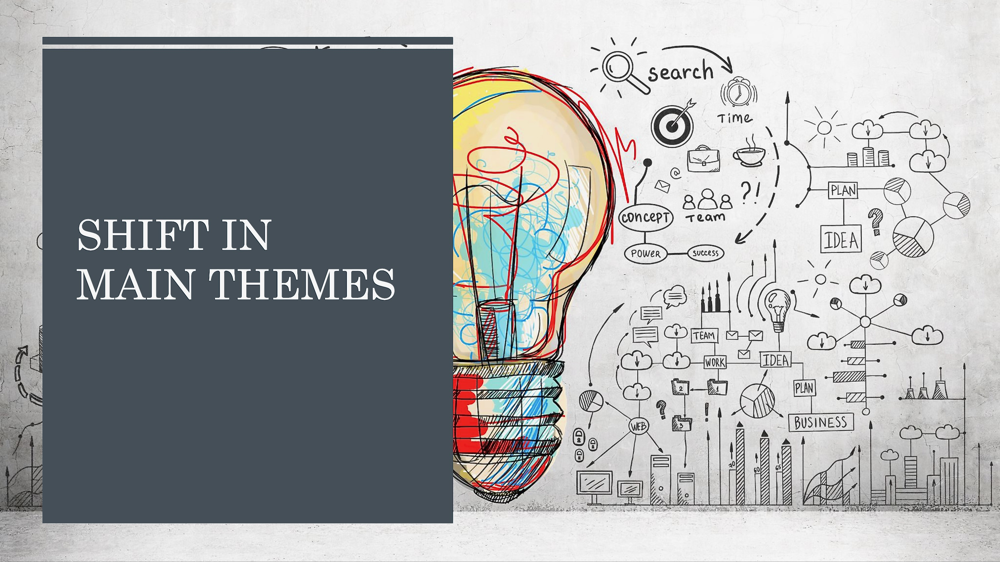
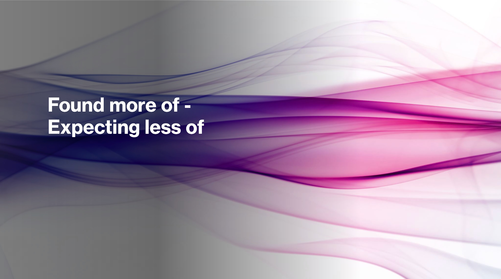

### Awesome-NeurIPS-2023 : Observations & Interesting Papers (selected from 3,584 papers)
#### _[Back to TOC](https://github.com/xsankar/Awesome-Awesome-LLM)_
| [About Me](https://www.linkedin.com/in/ksankar) | [Blog](https://ksankar.medium.com) |
| :- | :- |
> |***As of 11.30.23, I am working hard to build the repos - takes time to review and curate. Appreciate your patience ... Thanks ...***|
> | :- |
> 
---
| [Now](#now) | [Interesting](#interesting) | [Towards AGI](#towards-agi) | [Planning](#planning) | [Reasoning](reasoning) | [Alignment](alignment) | [RL](rl) |
| :- | :- | :- | :- | :- | :- | :- |

[Prompting](#prompting) | [Small Language Models](#slm) | [Training Efficiency](#training-efficiency) | [Fine Tuning/RAG](#fine-tuning-rag) | [Attack Mitigation](#attack-mitigation) | [Datasets](#datasets) | [Benchmarks](#benchmarks) |
| :- | :- | :- | :- | :- | :- | :- |

[Decoding Transformers](#decoding-transformers) | [NN Design & Insights](#nn-design--insights) | [Embedding](#embedding) |  | |  |  |
| :-: | :-: | :-: | :-: | :-: | :-: | :-: |

[Detection](#detection) | [Watermarking](#watermarking) | [Origin Attribution](#origin-attribution) | [Bias/Fairness](#bias-fairness) | [Explainability](#explainability) | [Other](#other) |  |
| :-: | :-: | :-: | :-: | :-: | :-: | :-: |
---
### Observations - [Blog](https://medium.com/@ksankar/neurips-2023-unboxed-whats-in-what-s-out-cutting-edge-generative-ai-research-from-3-784-eec08394eadb)

  
   

***

  
   

***

  
   

***

  
   

***

  
   

***
## Now
[Top](#back-to-toc)
| Year | Title | Notes | 
| -: | :- | :- |
| | Survey Papers | |
***
## Interesting
[Top](#back-to-toc)
| Year | Title | Notes | 
| -: | :- | :- |
| | Survey Papers | |
***
***
